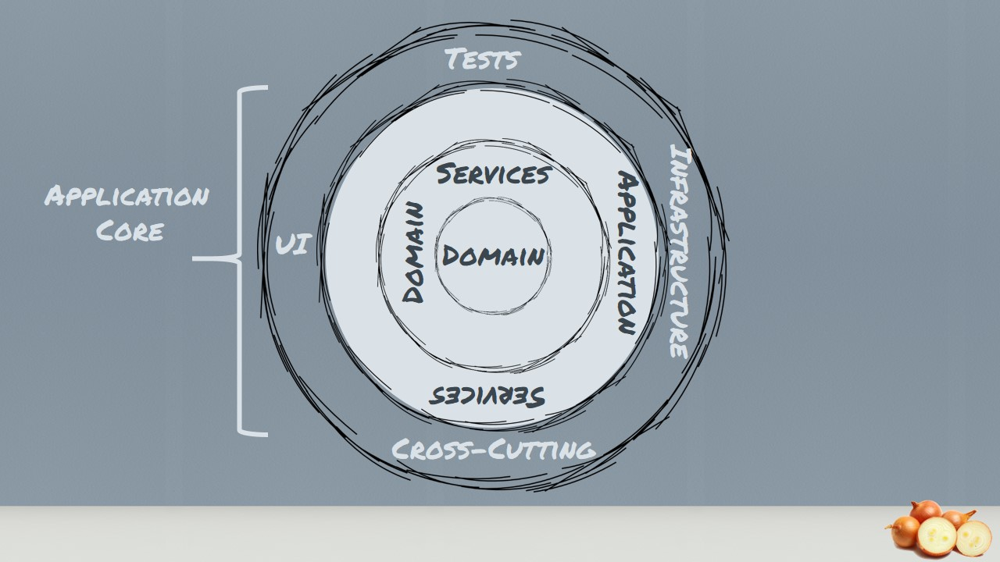

# GildedRose.Net

This is a application designed to solve the Gilded Rose Refactoring Kata. This API is using .Net Core 2.2, HostedService, Railway Oriented, Onion Architecture with DDD aproach, Swagger and Docker.

This is the link to the Kata requirements.

https://github.com/emilybache/GildedRose-Refactoring-Kata

## Installation

- Required .Net Core Framework 2.2 , Visual Studio or Visual Studio Code

Use the git to get GildedRose.Net.

```
git clone https://github.com/kinderbueno360/GildedRose.Net.git
```

Open Command and go to the Application Folder and execute restore command.

```
dotnet restore
```

## Architecture
- Onion Architecture

<p align="center">

</p>

## Technologies used:

- Native .Net Core DI

## Usage

Open Visual Studio and Press F5 to run te aplication.

To run unit tests go to option  Tests -> Run -> All Tests  or  CRTL+R,A.


## License

MIT
